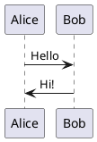
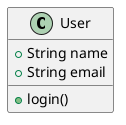
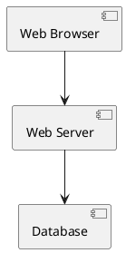
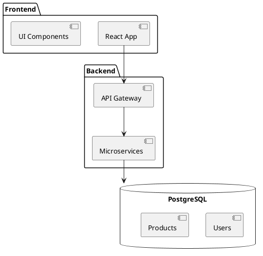

# PlantUML Diagram Generator Action

A reusable GitHub Action that automatically generates diagram images from PlantUML code blocks in markdown files and standalone `.puml`/`.plantuml` files.

## Features

- 🔍 Automatically detects PlantUML code blocks in markdown files
- 📄 Processes standalone `.puml` and `.plantuml` files
- 🖼️ Generates diagrams in PNG, SVG, or both formats
- 📁 Processes multiple files in a directory
- ⚡ Triggers on push of markdown or PlantUML files
- 🎨 Supports both `plantuml` and `puml` code block syntax

## Usage

### Basic Example

Create a workflow file (e.g., `.github/workflows/plantuml.yml`):

```yaml
name: Generate PlantUML Diagrams

on:
  push:
    paths:
      - '**.md'
      - '**.markdown'
      - '**.puml'
      - '**.plantuml'

jobs:
  generate-diagrams:
    runs-on: ubuntu-latest
    steps:
      - name: Checkout code
        uses: actions/checkout@v4

      - name: Generate PlantUML diagrams
        uses: titarenko/plantuml-action@v1
        with:
          source-path: '.'
          format: 'svg'

      - name: Commit generated diagrams
        run: |
          git config --local user.email "action@github.com"
          git config --local user.name "GitHub Action"
          git add '*png' || true
          git add '*svg' || true
          git diff --quiet && git diff --staged --quiet || git commit -m "Update PlantUML diagrams"
          git push
```

### Advanced Example with Multiple Formats

```yaml
name: Generate PlantUML Diagrams

on:
  push:
    paths:
      - '**.md'
      - '**.puml'
      - '**.plantuml'
  pull_request:
    paths:
      - '**.md'
      - '**.puml'
      - '**.plantuml'

jobs:
  generate-diagrams:
    runs-on: ubuntu-latest
    steps:
      - name: Checkout code
        uses: actions/checkout@v4
        with:
          fetch-depth: 0

      - name: Generate PlantUML diagrams
        id: plantuml
        uses: titarenko/plantuml-action@v1
        with:
          source-path: 'docs'
          format: 'both'
          plantuml-version: 'latest'

      - name: Show summary
        run: |
          echo "Generated ${{ steps.plantuml.outputs.diagrams-generated }} diagrams"
          echo "Diagram paths: ${{ steps.plantuml.outputs.diagram-paths }}"

      - name: Commit and push changes
        run: |
          git config --local user.email "action@github.com"
          git config --local user.name "GitHub Action"
          git add docs/
          if ! git diff --quiet --staged; then
            git commit -m "🎨 Update PlantUML diagrams [skip ci]"
            git push
          fi
```

## Inputs

| Input | Description | Required | Default |
|-------|-------------|----------|---------|
| `source-path` | Path to search for markdown and PlantUML files | No | `.` |
| `format` | Output format: `png`, `svg`, or `both` | No | `svg` |
| `plantuml-version` | PlantUML version to use | No | `latest` |

## Outputs

| Output | Description |
|--------|-------------|
| `diagrams-generated` | Number of diagrams generated |
| `diagram-paths` | Comma-separated list of generated diagram paths |

## Behavior

The action automatically detects changed files from the triggering commit using `git diff` and processes only those files. This makes it efficient for incremental updates. If no git repository is detected, it falls back to processing all files in the source path.

## Markdown Syntax

The action looks for PlantUML code blocks with either `plantuml` or `puml` syntax:

### Example 1: Sequence Diagram

````markdown

````

### Example 2: Class Diagram

````markdown

````

### Example 3: Component Diagram

````markdown

````

## Standalone PlantUML Files

The action also processes standalone `.puml` and `.plantuml` files directly:

### Example: `architecture.puml`



This file will generate `architecture.png` (or `.svg` based on your format setting).

## Diagram Output

Diagrams are generated in the same directory as their source files:

**For markdown files:**
- `docs/architecture.md` with one diagram → `docs/architecture.svg`
- `docs/api.md` with multiple diagrams → `docs/api_1.svg`, `docs/api_2.svg`, etc.

**For standalone PlantUML files:**
- `diagrams/sequence.puml` → `diagrams/sequence.svg`
- `src/flow.plantuml` → `src/flow.png`

## Example Repository Structure

```
my-project/
├── .github/
│   └── workflows/
│       └── plantuml.yml
├── docs/
│   ├── architecture.md       # Contains PlantUML diagrams
│   ├── architecture.svg      # Generated from architecture.md
│   ├── architecture_2.svg    # Second diagram from architecture.md
│   ├── api.md                # Contains PlantUML diagrams
│   ├── api.svg               # Generated from api.md
│   ├── sequence.puml         # Standalone PlantUML file
│   └── sequence.svg          # Generated from sequence.puml
└── README.md
```

## Permissions

The action requires the following permissions to commit generated diagrams:

```yaml
permissions:
  contents: write
```

Add this to your workflow file if you plan to commit the generated diagrams.

## License

MIT

## Contributing

Contributions are welcome! Please feel free to submit a Pull Request.
