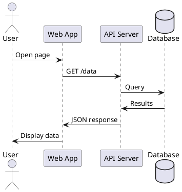
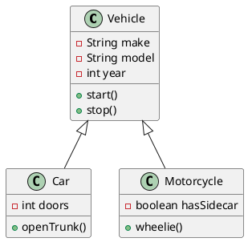
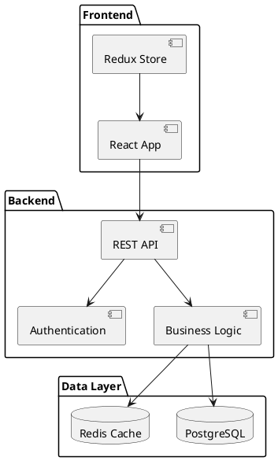

# Example Markdown with PlantUML Diagrams

This is an example markdown file demonstrating PlantUML diagrams.

## Sequence Diagram

```plantuml
@startuml
actor User
participant "Web App" as Web
participant "API Server" as API
database "Database" as DB

User -> Web: Open page
Web -> API: GET /data
API -> DB: Query
DB -> API: Results
API -> Web: JSON response
Web -> User: Display data
@enduml
```

## Class Diagram

```puml
@startuml
class Vehicle {
  -String make
  -String model
  -int year
  +start()
  +stop()
}

class Car extends Vehicle {
  -int doors
  +openTrunk()
}

class Motorcycle extends Vehicle {
  -boolean hasSidecar
  +wheelie()
}
@enduml
```

## Component Diagram

```plantuml
@startuml
package "Frontend" {
  [React App]
  [Redux Store]
}

package "Backend" {
  [REST API]
  [Authentication]
  [Business Logic]
}

package "Data Layer" {
  database "PostgreSQL"
  database "Redis Cache"
}

[React App] --> [REST API]
[Redux Store] --> [React App]
[REST API] --> [Authentication]
[REST API] --> [Business Logic]
[Business Logic] --> [PostgreSQL]
[Business Logic] --> [Redis Cache]
@enduml
```
